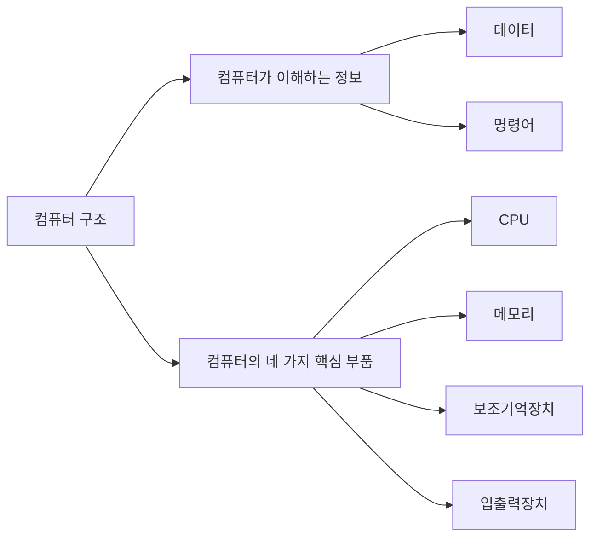

### **컴퓨터가 이해하는 두 가지 정보**

#### **1) 데이터**

- 숫자, 문자, 이미지, 동영상과 같은 정적인 정보
- 컴퓨터와 주고 받는 / 내부에 저장된 정보를 데이터라 통칭하기도 함
- 0과 1로 `숫자`를 표현하는 방법
- 0과 1로 `문자`를 표현하는 방법

#### **2) 명령어**

- 컴퓨터는 결국 명령어를 처리하는 기계
- 명령어
  - 컴퓨터를 실질적으로 움직이는 정보
  - 데이터는 명령어를 위한 일종의 재료

### **컴퓨터의 네 가지 핵심 부품**

#### **메모리 (Memory)**

> 현재 실행되는 프로그램의 명령어와 데이터를 저장하는 부품

- 프로그램이 실행되기 위해서는 메모리에 저장되어 있어야 함
- 메모리는 실행되는 프로그램의 명령어와 데이터를 저장
- 메모리에 저장된 값의 위치는 주소로 알 수 있음

#### **CPU**

> 메모리에 저장된 명령어를 읽어 드리고, 해석하고, 실행하는 부품

- ALU 산술 논리 연산 장치 : 계산기
- 레지스터 : CPU 내부의 작은 저장 장치
- 제어장치 : **제어 신호**를 내보내고, 명령어를 해석하는 장치
  - 제어 신호? > 컴퓨터 부품들을 관리하고 작동시키기 위한 전기 신호
    - CPU가 메모리에 저장된 값을 읽고 싶을 땐 메모리를 향해 `메모리 읽기` 라는 제어 신호를 보냄
    - CPU가 메모리에 어떤 값을 저장하고 싶을 땐 메모리를 향해 `메모리 쓰기` 라는 제어 신호를 보냄

| 정리                                                            |
| --------------------------------------------------------------- |
| CPU는 메모리에 저장된 값을 읽어 들이고, 해석하고, 실행하는 장치 |
| CPU 내부에는 ALU, 레지스터, 제어장치                            |
| ALU는 계산하는 장치                                             |
| 레지스터는 임시 저장 장치                                       |
| 제어 신호를 발생시키고 명령어를 해석하는 장치                   |

#### **보조기억장치**

> 전원이 꺼져도 보관될 프로그램을 저장하는 부품

- 메모리와의 차이점
  - 메모리는 `실행할 정보`를 저장하고, 보조기억장치는 `보관할 정보`를 저장
  - 전원이 꺼져도 저장할 수 있음
    - 메모리 = 휘발성 저장장치
    - 보조기억장치 = 비휘발성 저장장치

#### **입출력장치**

> 컴퓨터 외부에 연결되어 컴퓨터 내부와 정보를 교환할 수 있는 부품

- 가장 자주 접하는 장치 (=친숙한 장치)
  - 키보드, 마우스, 모니터, 스피커 등등..
- **보조기억장치와의 다른 점?**
  - 메모리를 보조하는 특별한 임무를 수행한다 = 보조기억장치 (e.g. USB, 외장하드 등..)

### **메인보드 (Motherboard)**

> 컴퓨터의 네 가지 핵심 부품들을 연결하고 서로 소통할 수 있게 하는 회로 기판

- 메인보드에 연결된 부품은 `버스`를 통해 정보를 주고 받음
- 버스는 컴퓨터의 부품끼리 정보를 주고 받는 일종의 통로
- 다양한 종류의 버스가 있음
- 컴퓨터의 핵심 부품을 연결하는 버스는 `시스템 버스`

#### **시스템 버스**

- 시스템 버스의 내부 구성
  - 주소 버스 : 주소를 주고 받는 통로
  - 데이터 버스 : 명령어와 데이터를 주고 받는 통로
  - 제어 버스 : 제어 신호를 주고 받는 통로
