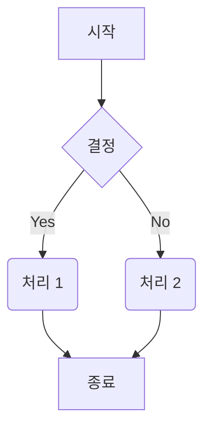

[참고 블로그 1](https://velog.io/@junho5336/Mermaid-%EC%82%AC%EC%9A%A9%ED%95%B4%EC%84%9C-%EC%84%A4%EA%B3%84%ED%95%98%EA%B8%B0)  
[참고 블로그 2](https://sabarada.tistory.com/209)

### **Mermaid란?**

> Markdown 문법을 이용하여 시각적인 다이어그램 Diagram을 표현할 수 있는 라이브러리

### **사전 필요 - Plugin**

- Mermaid를 사용하기 위해서는 Markdown에 Plugin이 필요
- 각 Editor 별 Plugin 리스트는 [다음](https://mermaid.js.org/ecosystem/integrations-community.html#editor-plugins)에서 확인

### **지원 Diagram**

Mermaid로 그릴 수 있는 Diagram의 종류는 다음과 같음
- 플로우차트 Flowchart
- 시퀀스 다이어그램 Sequence Diagram
- 간트차트 Gantt chart
- 클래스 다이어그램 Class Diagram
- User Journey Diagram

### **플로우차트 Flowchart 작성법**

Mermaid에서 플로우차트를 작성하는 방법

#### **1. 그래프 선언 및 방향**

플로우차트는 `graph` 또는 `flowchart` 키워드로 시작합니다. 그 뒤에 그래프의 방향을 지정합니다.

- `graph TD` 또는 `graph TB`: 위에서 아래로 (Top to Bottom)
- `graph BT`: 아래에서 위로 (Bottom to Top)
- `graph LR`: 왼쪽에서 오른쪽으로 (Left to Right)
- `graph RL`: 오른쪽에서 왼쪽으로 (Right to Left)

#### **2. 노드(Node)**

노드는 다이어그램의 각 요소를 나타냅니다. 다양한 모양으로 표현할 수 있습니다.

| 모양         | 구문             | 의미                    |
| ------------ | ---------------- | ----------------------- |
| 사각형       | `id[텍스트]`     | 프로세스 (처리 단계)    |
| 둥근 사각형  | `id(텍스트)`     | 시작 또는 끝            |
| 경기장 모양  | `id([텍스트])`   | 캡슐화된 프로세스       |
| 서브루틴     | `id[[텍스트]]`   | 미리 정의된 프로세스    |
| 원통         | `id[(텍스트)]`   | 데이터 저장소           |
| 원           | `id((텍스트))`   | 연결자 (페이지 내/외부) |
| 마름모       | `id{텍스트}`     | 결정 또는 분기          |
| 육각형       | `id{{텍스트}}`   | 준비 단계               |
| 평행사변형   | `id[/텍스트/]`   | 데이터 입/출력          |
| 역평행사변형 | `id[\\텍스트\\]` | 데이터 입/출력          |
| 사다리꼴     | `id[/텍스트\\]`  | 수동 입력               |
| 역 사다리꼴  | `id[\\텍스트/]`  | 수동 조작               |

#### **3. 연결(Link)**

노드들은 다양한 형태의 선으로 연결할 수 있습니다.

| 종류               | 구문                |
| ------------------ | ------------------- |
| 화살표             | `A --> B`           |
| 텍스트 포함 화살표 | `A -- 텍스트 --> B` |
| 선                 | `A --- B`           |
| 점선 화살표        | `A -.-> B`          |
| 굵은 화살표        | `A ==> B`           |

#### **예시**

---
