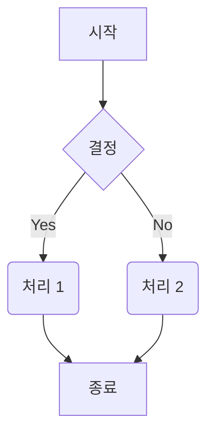
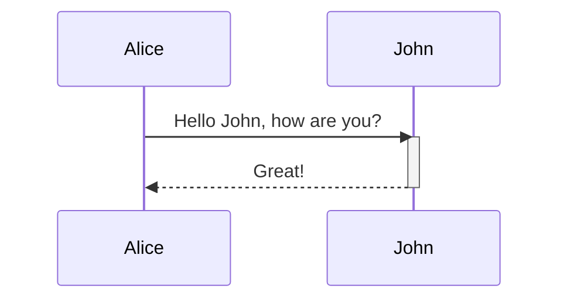
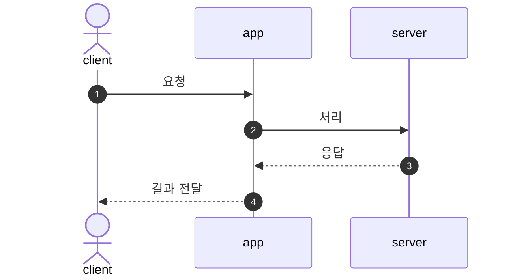
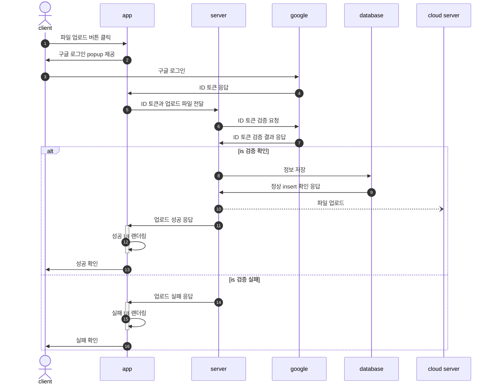

[참고 블로그 1 - flowchart](https://velog.io/@junho5336/Mermaid-%EC%82%AC%EC%9A%A9%ED%95%B4%EC%84%9C-%EC%84%A4%EA%B3%84%ED%95%98%EA%B8%B0) <br />
[참고 블로그 2 - flowchart](https://sabarada.tistory.com/209) <br />
[참고 블로그 3 - sequence diagram](https://velog.io/@qhflrnfl4324/Mermaid%EB%A5%BC-%EC%9D%B4%EC%9A%A9%ED%95%9C-%EC%8B%9C%ED%80%80%EC%8A%A4-%EB%8B%A4%EC%9D%B4%EC%96%B4%EA%B7%B8%EB%9E%A8)

### **Mermaid란?**

> Markdown 문법을 이용하여 시각적인 다이어그램 <sup>Diagram</sup>을 표현할 수 있는 라이브러리

### **사전 필요 - Plugin**

- Mermaid를 사용하기 위해서는 Markdown에 Plugin이 필요
- 각 Editor 별 Plugin 리스트는 [다음](https://mermaid.js.org/ecosystem/integrations-community.html#editor-plugins)에서 확인

### **지원 Diagram**

Mermaid로 그릴 수 있는 Diagram의 종류는 다음과 같음
- 플로우차트 <sup>Flowchart</sup>
- 시퀀스 다이어그램 <sup>Sequence Diagram</sup>
- 간트차트 <sup>Gantt chart</sup>
- 클래스 다이어그램 <sup>Class Diagram</sup>
- User Journey Diagram

### 1️⃣ **플로우차트 <sup>Flowchart</sup> 작성법**

Mermaid에서 플로우차트를 작성하는 방법

#### **1. 그래프 선언 및 방향**

플로우차트는 `graph` 또는 `flowchart` 키워드로 시작합니다. 그 뒤에 그래프의 방향을 지정합니다.

- `graph TD` 또는 `graph TB`: 위에서 아래로 (Top to Bottom)
- `graph BT`: 아래에서 위로 (Bottom to Top)
- `graph LR`: 왼쪽에서 오른쪽으로 (Left to Right)
- `graph RL`: 오른쪽에서 왼쪽으로 (Right to Left)

#### **2. 노드(Node)**

노드는 다이어그램의 각 요소를 나타냅니다. 다양한 모양으로 표현할 수 있습니다.

| 모양         | 구문             | 의미                    |
| ------------ | ---------------- | ----------------------- |
| 사각형       | `id[텍스트]`     | 프로세스 (처리 단계)    |
| 둥근 사각형  | `id(텍스트)`     | 시작 또는 끝            |
| 경기장 모양  | `id([텍스트])`   | 캡슐화된 프로세스       |
| 서브루틴     | `id[[텍스트]]`   | 미리 정의된 프로세스    |
| 원통         | `id[(텍스트)]`   | 데이터 저장소           |
| 원           | `id((텍스트))`   | 연결자 (페이지 내/외부) |
| 마름모       | `id{텍스트}`     | 결정 또는 분기          |
| 육각형       | `id{{텍스트}}`   | 준비 단계               |
| 평행사변형   | `id[/텍스트/]`   | 데이터 입/출력          |
| 역평행사변형 | `id[\\텍스트\\]` | 데이터 입/출력          |
| 사다리꼴     | `id[/텍스트\\]`  | 수동 입력               |
| 역 사다리꼴  | `id[\\텍스트/]`  | 수동 조작               |

#### **3. 연결(Link)**

노드들은 다양한 형태의 선으로 연결할 수 있습니다.

| 종류               | 구문                |
| ------------------ | ------------------- |
| 화살표             | `A --> B`           |
| 텍스트 포함 화살표 | `A -- 텍스트 --> B` |
| 선                 | `A --- B`           |
| 점선 화살표        | `A -.-> B`          |
| 굵은 화살표        | `A ==> B`           |

#### **예시**



---

### 2️⃣ **시퀀스 다이어그램 <sup>Sequence Diagram</sup> 작성법**

#### **1. 시퀀스 다이어그램이란?**

여러 컴포넌트(참여자) 간의 상호작용을 시간의 흐름에 따라 표현하는 다이어그램. 주로 시스템의 동작 흐름, API 호출, 사용자와 시스템의 상호작용 등을 시각화할 때 사용.

#### **2. 기본 선언 및 구조**

시퀀스 다이어그램은 다음과 같이 선언

```
sequenceDiagram
```

시퀀스 다이어그램은 방향 선언이 필요 없으며, 위에서 아래로 시간이 흐름

#### **3. 주요 구성요소**

- **participant**: 시스템, 객체 등 참여자를 네모 박스로 표현
- **actor**: 사용자 등 외부 참여자를 사람 아이콘으로 표현
- **메시지**: 참여자 간의 상호작용(화살표, 점선, X표 등 다양한 형태)
- **activation**: 특정 참여자가 활성화된 구간 표시 (activate, deactivate)
- **autonumber**: 메시지에 자동으로 번호 부여

##### **메시지 종류 예시**

| 구문    | 의미                            | 용도                                |
| ------- | ------------------------------- | ----------------------------------- |
| A->B:   | 끝이 화살표 없는 실선           | 일반 메시지, 요청, 호출             |
| A-->B:  | 끝이 화살표 없는 점선           | 일반 메시지(비동기/약한 연결)       |
| A->>B:  | 끝이 화살표 있는 실선           | 응답, 결과 전달, 명확한 방향성 표시 |
| A-->>B: | 끝이 화살표 있는 점선           | 비동기 응답, 약한 연결의 결과 전달  |
| A-xB:   | 끝이 X로 표시되는 실선          | 실패, 취소, 종료 알림               |
| A--xB:  | 끝이 X로 표시되는 점선          | 비동기 실패/취소 알림               |
| A-)B:   | 끝이 열린 화살표인 실선 (async) | 비동기 메시지, 콜백, 이벤트 트리거  |
| A--)B:  | 끝이 열린 화살표인 점선 (async) | 비동기 메시지(약한 연결), 콜백      |

##### **Activation 예시**



##### **Autonumber 예시**



#### **4. 전체 예시**



---
