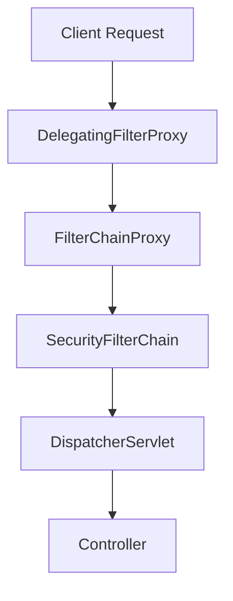

---

**SECaaS 연구소 지원을 받아 함께 진행하는 인증/인가 관련<br /> Spring Boot, Spring Security 프로젝트성 Study (251106 ~ )**

---

### 1주차

**Goal: Spring Security의 기본 베이스 지식을 이해**

- Spring Security가 왜 필터 기반 구조로 동작하는가
- 인증/인가가 어떤 객체와 흐름을 통해 처리되는가

#### 1. 개념의 구분

- 인증 <sup>Authentication</sup> : 사용자가 누구인지 확인하는 절차. 로그인 화면을 통해 사용자 아이디와 비밀번호를 입력받아 확인 하는 과정
- 인가 <sup>Authorization</sup> : 검증된 사용자가 특정 자원에 혹은 기능에 접근할 권한이 있는지 확인

#### 2. Spring Boot + Spring Security | 종속성 <sup>dependency</sup> 업데이트

- Spring Boot는 Spring Security 관련 종속성을 집계하는 `starter`를 제공
- 대표 starter
  - `spring-boot-starter-web`: MVC 서버 개발용
  - `spring-boot-starter-security`: Security 자동 구성 제공
    - 추가 하는 순간 아래 기능이 자동 적용
      - 모든 요청 인증 필요
      - 기본 로그인 화면 생성
      - user + 랜덤 패스워드 출력
      - 기본 SecurityFilterChain 자동 등록
- 종속성은 대표적으로 아래 두 가지 방식을 사용하여 추가
  - Maven: `pom.xml`
  - Gradle: `build.gradle`

> `spring-boot-starter-security` 추가 예시

**[Maven]**
```xml
<dependencies>
    <dependency>
        <groupId>org.springframework.boot</groupId>
        <artifactId>spring-boot-starter-security</artifactId>
    </dependency>
</dependencies>
```

**[Gradle]**
```groovy
dependencies {
	implementation "org.springframework.boot:spring-boot-starter-security"
}
```

---

### 3. Spring Security 동작 구조 (Filter 기반)

> Spring Security는 서블릿 필터 체인(Filter Chain) 구조로 동작



### 4. 핵심 구성 요소

1. **DelegatingFilterProxy**
   - 서블릿 컨테이너가 인식하는 유일한 필터
   - 실제 보안 필터는 `Spring Bean`으로 관리되므로, 이 Bean들을 호출하기 위한 **다리 역할**
2. **FilterChainProxy**
   - `DelegatingFilterProxy`로부터 전달받은 요청을 실제 `SecurityFilterChain`에 매핑
   - **URL 패턴**에 따라 필터 체인 선택 가능
3. **SecurityFilterChain**
   - 인증, 인가, 세션, 예외 처리 등 여러 필터들의 목록
   - `HttpSecurity` 설정 코드가 여기에서 적용됨

### 4-1. 주요 필터들 이해

**알아두면 좋은 필터들**
- **SecurityContextPersistenceFilter**
  - 인증 정보를 세션에서 꺼내오거나 저장함
  - 세션에서 인증 정보를 꺼내서 SecurityContext에 바인딩
- **UsernamePasswordAuthenticationFilter**
  - 폼 로그인("/login") 요청을 처리함
  - `/login` 요청을 가로채 ID/Password 기반 로그인 처리
- **BearerTokenAuthenticationFilter**
  - JWT/OAuth2 토큰을 처리함
  - Authorization 헤더에 Bearer 토큰 (JWT 등)을 읽어 인증 처리
- **AuthorizationFilter**
  - 권한을 검사해 접근 허용 여부를 결정함
  - 권한 체크(접근 제어)의 마지막 단계
- **ExceptionTranslationFilter**
  - 인증/인가 실패 시 `401` 또는 `403` 응답을 반환하거나 로그인 페이지로 리다이렉트함

### 5. Servlet Authentication Architecture 주요 객체
 
- **SecurityContextHolder**
  - Spring Security는 현재 인증된 사용자의 정보를 `SecurityContextHolder`라는 컨테이너에 보관
    - `ThreadLocal` 기반으로 보관
  - 인증이 필요한 요청을 처리할 때, 여기 저장된 정보를 기반으로 권한을 판단
- **SecurityContext**
  - `SecurityContextHolder` 안에는 `SecurityContext`라는 객체가 들어 있고, 여기에 현재 사용자의 `Authentication` 객체 정보가 들어 있음
- **Authentication**
  - 사용자의 인증 상태를 표현하는 인터페이스
  - 로그인 시도 시에는 아이디·비밀번호 같은 자격 증명이 담겨 있고, 인증 후에는 사용자 정보와 권한 목록이 채워짐
    - `principal`: 사용자 정보
    - `credentials`: 인증 정보 (자격 증명)
    - `authorities`: 권한 목록
  - Spring Security는 `Authentication` 객체를 **필터 체인**에서 전달하며 인증을 시도
- **GrnatedAuthority**
  - `ROLE_USER`, `ROLE_ADMIN` 같은 권한을 보관하는 곳
  - "이 기능은 관리자만 가능하다"고 설정하면, 이 목록에 해당 권한이 있는지 확인해 접근을 허용
- **AuthenticationManager**
  - 여러 종류의 인증 방식을 사용할 수 있도록, `AuthenticationProvider`들을 호출해 인증을 진행
  - 기본 구현체는 `ProviderManager`이며, 여러 Provider를 순차적으로 실행하면서 성공 여부를 판단
- **AuthenticationProvider**
  - 실제 인증 로직을 수행하는 모듈
  - 예를 들어 데이터베이스 기반 로그인(`DaoAuthenticationProvider`)이나 LDAP 로그인을 각각 다른 Provider로 구현
  - 각 Provider는 자신이 처리할 수 있는 유형의 인증인지 확인하고, 처리할 수 없다면 다음 Provider로 넘김
- **AuthenticationEntryPoint**
  - 인증이 필요하지만 아직 로그인하지 않은 사용자를 처리하는 지점
  - 인증되지 않은 사용자에게 로그인 페이지를 보여주거나, HTTP 401/403 같은 오류를 반환
- **AbstractAuthenticationProcessingFilter**
  - 인증 요청을 가로채는 필터
  - HTTP 요청에서 자격 증명을 추출하고 `AuthenticationManager`로 전달하는 기본 클래스
  - 예를 들어 `UsernamePasswordAuthenticationFilter`가 이 클래스를 상속해 아이디/비밀번호 로그인을 처리

---

### 기타 개념

> 인증 실패/성공 시 반환 상태 코드

| 상태             | 의미                                          |
| ---------------- | --------------------------------------------- |
| 401 Unauthorized | 인증되지 않은 상태에서 보호된 리소스 접근     |
| 404 Not Found    | 인증은 되었으나 존재하지 않는 엔드포인트 요청 |
