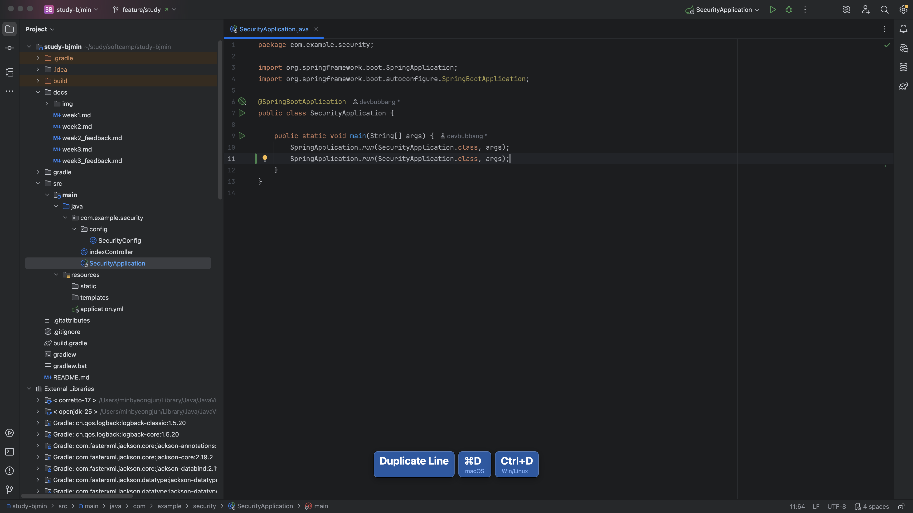

> 예전 강의이기 때문에 (2018년 정도 추정) 수정되어야 하는 정보나 잘못된 정보가 있을 수 있음
{: .prompt-info}

### **Toolbox App**

> JetBrains 도구를 간편하고 빠르게 관리할 수 있는 도구 **[링크](https://www.jetbrains.com/ko-kr/toolbox-app/)**

---

### **프로젝트 생성하기**

> IntelliJ Community Edition과 Ultimate Edition의 주요 차이점은 **웹 관련 기술 지원 범위** 

> Community 버전은 Java 등 기본 기능에 초점을 맞추고, Ultimate 버전은 Spring, JSP 등 다양한 웹 관련 기술들을 추가로 지원하는 유료 버전.

- **프로젝트 생성**
  - 템플릿 선택: Maven, Gradle 같은 빌드 환경 선택을 추천
  - 의존성 `dependency` 관리 환경을 사용하지 않으면 불편한 점이 많음
- **단축키 관련 플러그인**
  - OS에 따라 사용되는 단축키가 다름 (Windows, Mac, Linux ..)
  - Plugins > **`presentation Assistant`**
   
  - 실제 사용 화면
   

---
