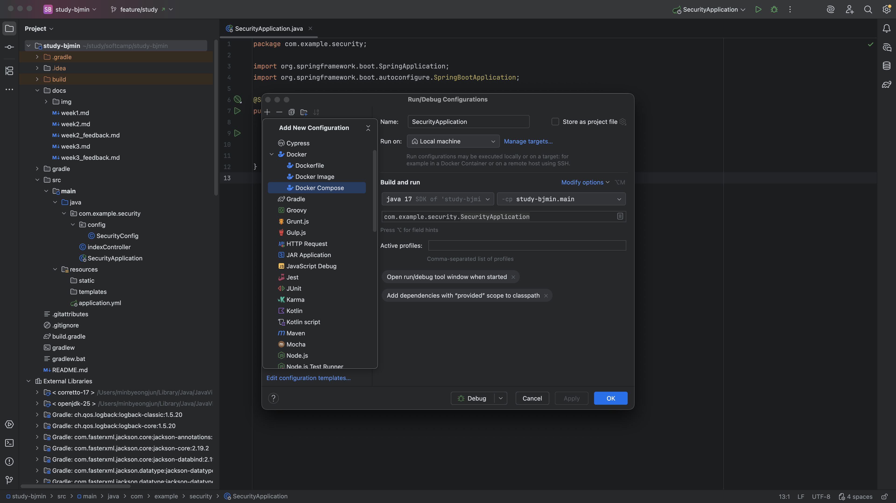

### **디렉토리, 패키지, 클래스 등 생성 목록 보기**

> 표준적으로 자바의 디렉토리 구조는 **src/main/java** 라는 구조를 갖고 있다.
{:.prompt-info}

```text
Directory       // 슬래쉬(/) 단위로 계층 구분
    Package     // 점(.) 단위로 계층 구분
        Class
```

> 현재 있는 위치를 기준으로 생성 가능한 목록 보기 단축키

- Mac: `Command` + `N` <br/>
- Windows, Linux: `Alt` + `Insert`

### **코드 템플릿**

> 메인 메소드를 만드는 코드 템플릿은 `psvm` 이다.

이는 `public static void main`의 각 앞글자를 딴 축약어(단축키) 이다.

> 콘솔 출력을 위해 필요한 코드 템플릿은 `sout`이다.

이는 `System.out.println()`을 빨리 실행할 수 있게한 축약어(단축키) 이다.

- sout의 옵션에는 다음과 같은 항목들이 있다.
  - `soutv`: 현재 커서 위치 또는 **이전에 선언된 변수의 이름과 그 값을 함께 출력**하는 구문 자동 완성
  - `soutm`: 현재 코드가 속한 **메서드의 이름을 출력**하는 코드를 자동 생성
  - `soutp`: 현재 코드가 속한 **메서드의 파라미터(매개변수) 를 출력**하는 코드를 자동 생성

### **실행환경 실행**

1. **현재 포커스**
   - Mac: `Ctrl` + `Shift` + `R`
   - Windows, Linux: `Shift` + `Ctrl` + `F10`
2. **이전 실행**
   - Mac: `Ctrl` + `R`
   - Windows, Linux: `Shift` + `F10`

**Configuration:** 우측 상단에 위치, 현재까지 내가 실행 시켰던 환경을 볼 수 있음

- Community, Ultimate 버전에 따라 실행 (사용) 시킬 수 있는 지원 항목을 보여줌 

---

### **라인 복제하기 (Duplicate)**

- Mac: `Command` + `D`
- Windows, Linux: `Ctrl` + `D`


> **커서 위치에 상관 없이 라인 자체를 복제하는 행위**

### **라인 삭제하기**

- Mac: `Command` + `백스페이스(Backspace)`
- Windows, Linux: `Ctrl` + `Y`

> **커서 위치에 상관 없이 라인 자체를 삭제하는 행위**

### **라인 합치기 (Join)**

- Mac: `Ctrl` + `Shift` + `J`
- Windows, Linux: `Ctrl` + `Shift` + `J`

### **라인 단위로 옮기기**

1. **구문 내 이동** <sup>Move Statement Up/Down</sup>
   - Mac: `Shift` + `Command` + `⬆️ 또는 ⬇️`
   - Windows, Linux: `Shift` + `Ctrl` + `⬆️ 또는 ⬇️`
2. **라인 이동** <sup>Move Line Up/Down</sup>
   - Mac: `Shift` + `Option` + `⬆️ 또는 ⬇️`
   - Windows, Linux: `Shift` + `Alt` + `⬆️ 또는 ⬇️`

### **Element 단위로 옮기기**

> **Element: html이나 xml 같은 규격이 정해진 마크업 언어들에 주료 사용되는 항목** <br />
> HTML 예시: id, name 등

- Mac: `Option` + `Shift` + `Comand` + `⬅️ 또는 ➡️`
- Windows, Linux: `Alt` + `Ctrl` + `Shift` + `⬅️ 또는 ➡️`

---

### **인자값 즉시 보기**

> **생성자**의 인자값들이 뭔지 즉시 볼 수 있는 방법

- Mac: `Command` + `P`
- Windows, Linux: `Ctrl` + `P`

**각각의 멤버 변수로 어떤 이름으로 쓰이는지까지 전부 나온다.**<br/>
**메서드에도 동일하게 적용된다.**

### **코드 구현부 즉시 보기**

> **메서드**의 실제 구현코드를 즉시 볼 수 있는 방법

- Mac: `Option` + `Space`
- Windows, Linux: `Shift` + `Ctrl` + `I`

**포커스 위치가 어디냐에 따라서 보여주는 부분이 달라진다.**

### **Doc 즉시 보기**

- Mac: `F1`
- Windows, Linux: `Ctrl` + `Q`

---
